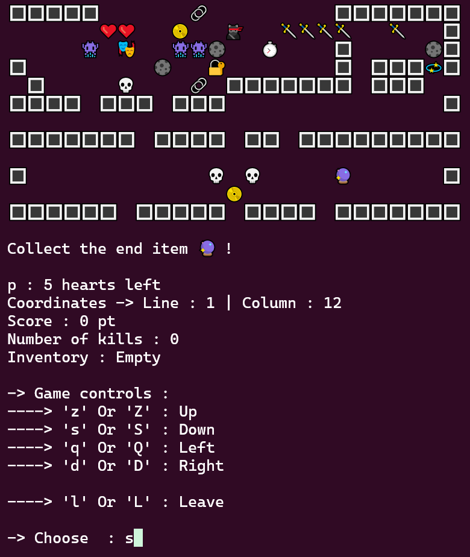

<h1 align="center">🐱‍👤 RayXPlore 🐱‍👤</h1>



## Table of contents

- [Description](#description)
- [Architecture](#architecture)
- [Prerequisites](#prerequisites)
- [Installation](#installation)
- [Commands](#commands)
- [Technologies](#technologies)
- [Tutorial](#tutorial)
- [License](#license)
- [Author](#author)

## Description

**RayXPlore** is a Java console application where you can create your own levels and play them. The levels take the form of `.txt` files in which you can model your own maps in order to challenge yourself by playing them. You can choose where to place the player, the enemies and their types, the items, and so on. Once you have finished modelling the levels, the goal is to play them all until you win, that is how you know you succeeded and that it is time to make the levels more difficult and tricky.

## Architecture
```
.
├── LICENSE
├── Makefile
├── README.md
├── RayXPlore.png
├── bin
│   └── com
│       └── app
│           ├── Main.class
│           ├── cell
│           │   ├── Cell.class
│           │   ├── CellType.class
│           │   └── Coordinates.class
│           ├── display
│           │   └── View.class
│           ├── entity
│           │   ├── Entity.class
│           │   ├── Player.class
│           │   └── enemy
│           │       ├── Enemy.class
│           │       ├── Ghost.class
│           │       ├── Hunter$1.class
│           │       ├── Hunter.class
│           │       ├── Monster.class
│           │       └── Skeleton.class
│           ├── level
│           │   ├── Direction.class
│           │   ├── Level$1.class
│           │   ├── Level.class
│           │   ├── LevelLoader.class
│           │   ├── WinCondition.class
│           │   └── wincondition
│           │       ├── CoinCondition.class
│           │       ├── EnemyCondition.class
│           │       ├── ItemCondition.class
│           │       ├── Win.class
│           │       └── WinCondition.class
│           └── usable
│               ├── Triggerable.class
│               ├── Usable.class
│               ├── UsableComparator.class
│               ├── Weapon.class
│               ├── item
│               │   ├── Item.class
│               │   ├── consumable
│               │   │   ├── Coin.class
│               │   │   ├── Consumable.class
│               │   │   └── Heart.class
│               │   └── equipable
│               │       ├── End.class
│               │       ├── Equipable.class
│               │       ├── Hourglass.class
│               │       ├── Swap.class
│               │       └── Sword.class
│               └── skill
│                   ├── Bomb.class
│                   ├── Lockpicking.class
│                   ├── Skill.class
│                   └── Teleportation.class
├── doc
│   └── ...
├── game.jar
├── map1.txt
├── map2.txt
├── map3.txt
└── src
    └── com
        └── app
            ├── Main.java
            ├── cell
            │   ├── Cell.java
            │   ├── CellType.java
            │   └── Coordinates.java
            ├── display
            │   └── View.java
            ├── entity
            │   ├── Entity.java
            │   ├── Player.java
            │   └── enemy
            │       ├── Enemy.java
            │       ├── Ghost.java
            │       ├── Hunter.java
            │       ├── Monster.java
            │       └── Skeleton.java
            ├── level
            │   ├── Direction.java
            │   ├── Level.java
            │   ├── LevelLoader.java
            │   └── wincondition
            │       ├── CoinCondition.java
            │       ├── EnemyCondition.java
            │       ├── ItemCondition.java
            │       ├── Win.java
            │       └── WinCondition.java
            └── usable
                ├── Triggerable.java
                ├── Usable.java
                ├── UsableComparator.java
                ├── Weapon.java
                ├── item
                │   ├── Item.java
                │   ├── consumable
                │   │   ├── Coin.java
                │   │   ├── Consumable.java
                │   │   └── Heart.java
                │   └── equipable
                │       ├── End.java
                │       ├── Equipable.java
                │       ├── Hourglass.java
                │       ├── Swap.java
                │       └── Sword.java
                └── skill
                    ├── Bomb.java
                    ├── Lockpicking.java
                    ├── Skill.java
                    └── Teleportation.java
```

- **Makefile** : to run the project and other commands easily

- **bin** : contains the compiled `.class` files

- **doc** : contains the Javadoc documentation

- **src** : contains the `.java` files

- **game.jar** : the `.jar` target of the project

## Prerequisites

- Java 21+
- Make

## Installation

Install Java and Make if not done yet :

```bash
# Debian / Ubuntu
sudo apt update
sudo apt install -y openjdk-21-jdk make
```

Check that the right version is installed :

```bash
java -version
make --version
```

1. **Clone the repository**
```bash
git clone https://github.com/RayyyZen/RayXPlore.git
```

2. **Go to the project folder**
```bash
cd RayXPlore/
```

3. **Run the project, giving as PARAM the different `.txt` files that define the levels**
```bash
make run PARAM="fileName1.txt fileName2.txt ..."
```

**N.B.** There are also some map templates that you can try by running this command :
```bash
make run PARAM="map1.txt map2.txt map3.txt"
```

### Files content

The files you give as arguments to the program represent the levels you will be playing. They must follow some rules :

- They must be `.txt` files

- You must give, as arguments, the paths to the files you chose

- They must contain only these characters :

    - `\n` : to add a line

    - `1` : Player

    - ` ` : Empty (CellType)

    - `#` : Wall (CellType)

    - `*` : Trap (CellType)

    - `D` : Locked door (CellType)

    - `h` : Hole (CellType)

    - `B` : Movable box

    - `R` : Monster (Enemy)

    - `G` : Ghost (Enemy)

    - `C` : Hunter (Enemy)

    - `K` : Skeleton (Enemy)

    - `.` : Coin (Consumable item)

    - `E` : Heart (Consumable item)

    - `W` : Sword (Equipable item)

    - `H` : Hourglass (Equipable item)

    - `O` : Swap (Equipable item)

    - `N` : End (Equipable item)

- They must contain exactly one occurrence of the character `1`, which represents the initial position of the player, and a maximum of one occurence of character `N`, which represents an item that ends the game if collected

## Commands

- Run the project :
```bash
make run PARAM="fileName1.txt fileName2.txt ..."
```
OR
```bash
make runJar PARAM="fileName1.txt fileName2.txt ..."
```

- Create a `.jar` target :
```bash
make jar
```

- Generate the Javadoc documentation :
```bash
make doc
```

## Technologies

- **Language** : Java 21
- **Build** : Makefile
- **Interface** : Console

## Tutorial

Your goal is to go through all the levels and survive until you finish them. You start with **5 hearts** and you must avoid the enemies and the traps while taking all the coins to complete each level. The game ends when you achieve the level's win condition, when you lose all your hearts, or when you leave the game. **The map is circular, so if you go outside the map at the top, you will find yourself at the bottom.**

### Objects

- `1` or 🐱‍👤 : represents you — you can move through the levels
- `S` or 🌀 : represents the spawn (your initial position on the level) ; if you lose a heart you come back there
- `#` or 🔳 : represents walls — you can't pass through them
- `*` or 🔗 : represents traps ; if you step on one you lose **2 hearts**
- `D` or 🔐 : represents locked doors — you can't pass through them
- `h` or 💫 : represents holes ; they can be closed by pushing a movable box onto them
- `B` or 🌑 : represents boxes ; they can be moved, even in a stack
- `R` or 👾 : represents a monster that moves randomly, has 1 heart and deals 1 damage
- `G` or 👻 : represents a ghost that moves horizontally or vertically through the walls, has 1 heart and deals 1 damage
- `C` or 🤖 : represents a hunter that follows the player, has 2 hearts and deals 3 damage
- `K` or 💀 : represents a skeleton that moves towards the player only if he is one cell away, has 2 hearts and deals 3 damage
- `.` or 📀 : represents coins ; you need to take them all to finish a level
- `E` or ❤ : represents a heart that gives the player +1 heart
- `W` or 🗡 : represents a sword that hits an enemy if it touches you
- `H` or ⏱ : represents an hourglass that freezes the enemies for 10 turns
- `O` or 🎭 : represents a swap item that makes the player swap places with a random enemy
- `N` or 🔮 : represents an end item that is used to finish a level

### Controls

- `d` or `D` : right
- `q` or `Q` : left
- `z` or `Z` : up
- `s` or `S` : down
- `l` or `L` : leave the game

- `1`, `2`, etc. : choose an item to use from the player's inventory

## License

This project is licensed under the BSD 2-Clause License. See the [LICENSE](LICENSE) file for details.

## Author

- Rayane M.